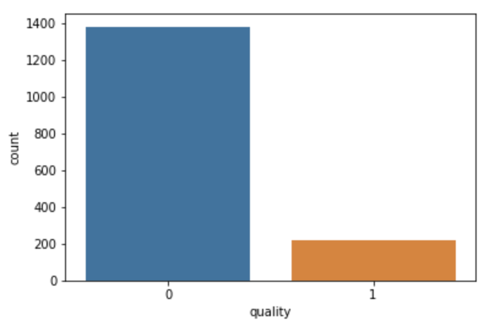
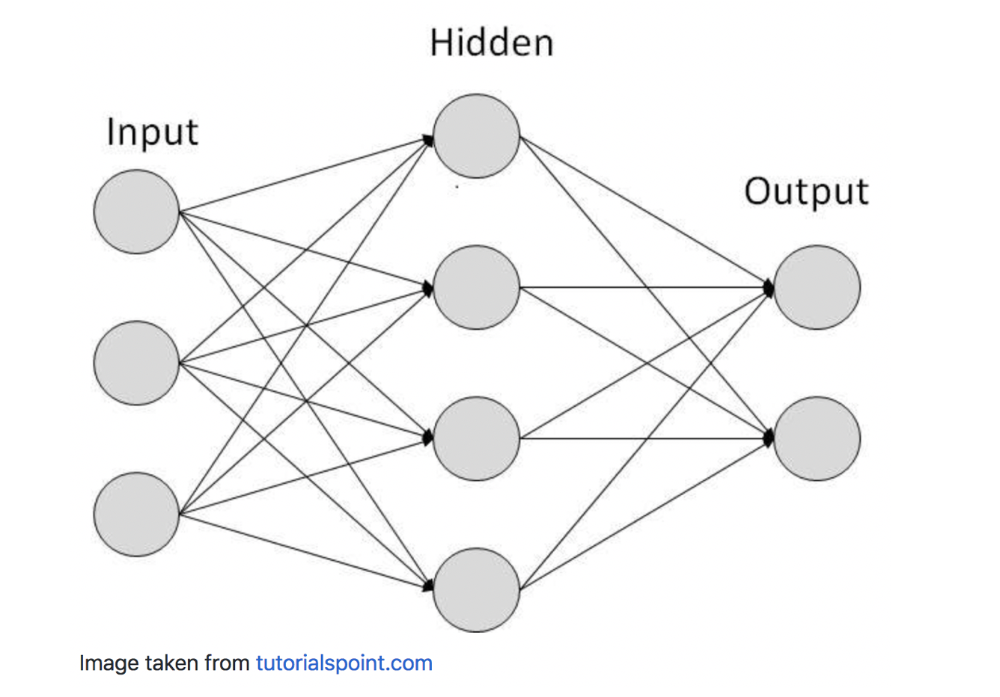

# ClassifyWineQuality
A simple Machine Learning project using SciKit Learn through the classification of wine quality

To begin, import the required packages, namely (1) Pandas, (2) Seaborn, (3) MatPlotLib, (4) Sklearn.

```python
import pandas as pd
import seaborn as sns
import matplotlib.pyplot as plt
from sklearn.ensemble import RandomForestClassifier
from sklearn.svm import SVC
from sklearn import svm
from sklearn.neural_network import MLPClassifier
from sklearn.metrics import confusion_matrix, classification_report
from sklearn.metrics import accuracy_score
from sklearn.preprocessing import StandardScaler, LabelEncoder
from sklearn.model_selection import train_test_split
%matplotlib inline
```
`Pandas` is a very helpful library that aids in the manipulation and analysis of data. We will be working with a lot of data, hence Pandas is very important.

`Seaborn` is used for data visualization. Although not required for the purposes of our exemplar, it is still good to have it to gain some insights based on what we can see on the data through the visuals.

`MatPlotLib` is a 2D plotting library used in Python. `Seaborn`'s data visualization is based off of `MatPlotLib` - so we will import this as well. But again, is not necessary if Seaborn isn't used.

`Sklearn` (or SciKitLearn) is the machine learning library in Python, and it contains several various ML algorithms that we can use. For the purposes of this example, we will take a look into Random Forest Classifier, Support Vector, and Multi-Layer Perceptron. There are still a lot more of these algorithms such as Logistic Regression, k-Nearest Neighbors, Naive Bayes, etc.; but if you are interested check out the link: https://scikit-learn.org/stable/

Let us begin by examining our data. For this, we will be using the `winequality-red.csv` dataset; you can download this dataset from Kaggle here: https://www.kaggle.com/uciml/red-wine-quality-cortez-et-al-2009

Now open your PyCharm, NotePad++, Sublime Text, or any other text-editor. Note that we will be working with Python for this example, so it is assumed that you have the basics of Python. But do not worry, if you are struggling with Python, you can just Google it up (especially the syntax), or read through here: https://www.w3schools.com/python/. Anyway, I am using the Jupyter Notebook in the Anaconda Navigator; it is very easy and convenient to use. I can easily run it and see the output right away because it compiles automatically. Below displays the two lines for loading our wine dataset into Python, store it into a dataframe called `wine` as well as displaying the first five rows of the dataframe.

```python
wine = pd.read_csv('winequality-red.csv', sep = ';')
wine.head()
```
This is the work of Pandas; it reads through our CSV file, with semi-colons as separators. It then stores it into a dataframe called `wine`. Here is what the first five rows of the dataframe looks like:


Also, typing in `wine.info()` gives some summarized information on what data are we dealing with:

```
<class 'pandas.core.frame.DataFrame'>
RangeIndex: 1599 entries, 0 to 1598
Data columns (total 12 columns):
fixed acidity           1599 non-null float64
volatile acidity        1599 non-null float64
citric acid             1599 non-null float64
residual sugar          1599 non-null float64
chlorides               1599 non-null float64
free sulfur dioxide     1599 non-null float64
total sulfur dioxide    1599 non-null float64
density                 1599 non-null float64
pH                      1599 non-null float64
sulphates               1599 non-null float64
alcohol                 1599 non-null float64
quality                 1599 non-null int64
dtypes: float64(11), int64(1)
memory usage: 150.0 KB
```

Normally, the dataset the you come across with contains some null values, or values that are blanks or missing. In that case, you have several options to handle such. One is to convert such values into 'legitimate' values. Another is to just take them out completely (i.e. remove the row containing `NULL` values completely). The latter option is highly recommended only if there are a few missing values. Otherwise, you might consider the former option as well. But for our exemplar, there is no need to deal with this as there are no null values. This is an ideal situation by the way, but not always. To verify this type in `wine.isnull.sum()`.

Now it is time for some data pre-processing. Try going over this code for now and I will explain in detail.

```python
bins = (2, 6.5, 8)       
group_names = ['bad', 'good']
wine['quality'] = pd.cut(wine['quality'], bins = bins, labels = group_names) 
wine['quality'].unique()
```

Ok, so first off we have to identify the dependent variable amongst our variables. It should have been done before, if you ask me. So since we are testing the quality of wine and that is the problem in hand, then therefore, the `quality` is our dependent variable (the `y`), while the rest of the other variables are the `x`'s (the independent variable). So now that we have identified our depenent variable, we can start looking at the code above and potentially the ones below. Let `bins` be a vector with the parameters `2`, `6.5`, and `8`. The number of bins is 2 (i.e. 2 bins of `quality`), the spread has a value of `6.5` and it has an index of `8`. The restriction for this triple is that it has to be monotonously increasing. `group_names` is just an array containing the label names for the wines, the bad wine and the good wine. For the purposes of this example, bad wines are those wines whose quality is less than 6.5; the good wines are those wines with quality of 6.5 and above. Notice that the minimum quality of wine is 2 and the maximum is 8. So bad wines are those wines whose quality is between 2 and 6.5 inclusive, and those wines between 6.5 and 8 are the good wines (viewing this in a spreadsheet or Excel file might convince you easily). The third line in the code above uses Pandas' cut function in order to cut or categorize the wines as good or bad depending on the quality. It makes use of the `bins` and `group_names`. `wine['quality'].unique()` simply outputs the unique values of `wine['quality']`

```python
[bad, good]
Categories (2, object): [bad < good]
```

The next two lines deals with the `LabelEncoder()` which encodes labels with values between `0` and `1` (can change depending on the number of classes). I would normally use the `.head()` function to see the data manipulated at hand currently; but I would simply do so at the end so as not to be repetitive.

```python
label_quality = LabelEncoder()
wine['quality'] = label_quality.fit_transform(wine['quality'])
```

By the way, there is a method called `wine['quality'].value_counts()` which allows you to know how many of the items in the column are `0`s and how many are `1`s. In our dataset, we should have 1382 `0`s and 217 `1`s. Also, another interesting thing is that we can use `Seaborn` in order to get a quick visual on our data. To do so, just type in `sns.countplot(wine['quality'])`, and it should output this:



Now, we will be doing a couple of more things to get ourselves ready to perform some machine learning algorithms. 

```python
#Now separate the dataset as response variable and feature variables
X = wine.drop('quality', axis=1)
y = wine['quality']

#Train and test splitting of data
X_train, X_test, y_train, y_test = train_test_split(X, y, test_size = 0.2, random_state = 42)

#Applying Standard scaling to get optimized result
sc = StandardScaler() 
X_train = sc.fit_transform(X_train)
X_test = sc.transform(X_test)
```

The first block of the code above allows the dataset to be separated into response and feature variables, that is to say all independent variables (the `x`'s are now on one the dataframe `X`) while the dependent variable `quality` will be in the variable `y`.  So `X = wine.drop('quality', axis=1)` will drop the column `quality` (we know it's column because we specified the `axis` as `1`; `0` if it was a row). Furthermore, note that because of immutability, then `wine.drop('quality', axis=1)` does not really do anything. Assigning this to `wine` however or some other variable changes everything! In `y = wine['quality']`, we extract the column `quality` from the dataframe `wine` and dump it into `y`.

Now it is time to train and test split the data. Have four variables ready: `X_train`, `X_test`, `y_train`, `y_test`. The `train_test_split()` method helps us with this. In takes in four parameters, the first two being the feature and response variables respectively. The third one determines how much of the dataset becomes the testing size. In our code, we use one-fifth of it or 20%. `random_state` is our fourth parameter and is some random seed, which doesn't really matter.

Standard Scaling is a critical step too as it optimizes the result. Imagine that a few of your feature variables deal with decimals while the others deal with hundreds or thousands? That will be a problem since it can cause some overpower in some parts of your data. Hence, to level this playing field we apply Standard Scaling, using the `StandardScaler()` from the SciKitLearn library. We then use a `fit_transform` on the `X_train` that we just trained, and then transform this into the `X_test`. And now, we are ready to apply some Machine Learning Algorithms.

## Random Forest Classifier
Here is the code to be used for the Random Forest Classifier. The parameter `n_estimators` simply determines how many forests are there in the tree. In my case, I have used 200. We shall then fit the `X` and the `y` that we used for training and use the model to predict the quality of the wine for those in the test set. We will then be comparing the predicted values vs the actuals through the use of the scoring metrics, such as the Confusion Matrix. We will talk more about this and accuracy later. For now, let us cover the two other algorithms.

```python
rfc = RandomForestClassifier(n_estimators=200) 
rfc.fit(X_train, y_train)
pred_rfc = rfc.predict(X_test)
```

## Support Vector Classifier (SVC)
The SVC (or SVM, Support Vector Machines), unlike the Random Forest Classifier, have no parameters. Hence:

```python
clf = svm.SVC()
clf.fit(X_train, y_train)
pred_clf = clf.predict(X_test)
```

## Multi-Layer Perceptron Classifier (MLPC)
The one that concerns Deep Learning, or the Neural Networks wherein the input (the feature variables) go through a series of networks called the hidden layers and will eventually end up with an output or a single output. Each one is called a node and forms a network that of a brain neuron, hence it is called the neural networks. As an illustration:



The Multi-Layer Perceptron Classifier (MLPC) is not-so-good with smaller datasets (such as this one). It works better for larger datasets such as Twitter feeds, etc. In our code below, since we made use of 11 variables, then we have 11 nodes for each hidden layer, and we assume that there are three hidden layers. Let the tolerance or max number of iterations be 500. The default is 200 by the way. Then we do the same thing as RFC and SVC.

```python
mlpc = MLPClassifier(hidden_layer_sizes=(11,11,11), max_iter=500)
mlpc.fit(X_train, y_train)
pred_mlpc = mlpc.predict(X_test)
```

## Performance and Accuracy
The performance, or how well the model has performed is based off of three important metrics (thanks to our initial package imports!). The first is the Precision, the second is the Recall and the third is the F1-Score. All these are based of the Confusion Matrix, that compares the predicted values made by the model, and the actual values in the test set. There are four: the True Positive (or TP, which means that the model was able to predict a `1` while the actual value was also a `1`), the True Negative (or TN, similar to TP but for `0`s time), the False Positive (or FP, where the model predicts a `1` when it should have actually predicted a `0`) and the False Negative (or FN, which is a vice versa of the previous). These four make up of the Confusion Matrix. You need not really know about it but the Precision and Recall are based off of the number of TP, TN, FP and FN that has been calculated and there is a formula for it, but it's not really necessary to know as SciKitLearn calculates it for you. The F1-Score is a score based off of Precision and Recall, and again formula is not of the essence.

If we would like a display of the calssification report and the confusion matrix, simply type in

```python
print(classification_report(y_test, pred_rfc))
print(confusion_matrix(y_test, pred_rfc)) 
```

Notice that the above lines are for the Random Forest Classifier, you simply need to change the parameters to `pred_clf` and `pred_mlpc` respectively in order to show the reports and matrices for the SVC and MLPC. For the above, it should output something like this

```
             precision    recall  f1-score   support

          0       0.92      0.97      0.94       273
          1       0.74      0.53      0.62        47

avg / total       0.90      0.90      0.90       320

[[264   9]
 [ 22  25]]
```

To interpret this result, this means that the model is accurately able to predict only 25 good wines and 264 bad wines. It was able to predict 31 wines incorrectly; it had said that 9 were good when it was actually bad (False Positive), but then it also said that 22 were bad when they were all actually good (False Negative).

For accuracy, simply type in `accuracy_score(y_test, pred_rfc)` to calculate the accuracy of our Random Forest Classifier model. On average, you should get around `0.903125`. And this is a good accuracy for a model. Do the same for the SVC and MLPC and see what you get.

## Testing
It's good to test out your model! Have this block of code

```python
Xnew = [[7.3,0.58,0.00,1.8,0.065,15.0,21.0,0.9946,3.36,0.45,9.1]]
Xnew = sc.transform(Xnew)
ynew = rfc.predict(Xnew)
ynew
```

We are simply giving it a new input, all data values unique from any data in our initial dataset. The RFC will predict 1 or 0 (good or bad wine). We cannot guarantee for sure if it was able to predict correctly, although we know that it had a good prediction due to the high 90% accuracy. This should output a bad wine.

From here, there are multiple things you can do. You can try out and test using SVC and MLPC models. Do they output the same result? How about try running another ML model? How about adding more data into your dataset. The more data your dataset has, the more data you can use to train and test your models with.

## Final Words
Credits given to this YouTube channel for putting up a SciKitLearn Machine Learning in Python tutorial video: https://www.youtube.com/watch?v=0Lt9w-BxKFQ. I learned a lot from this guy, so go check him out and his other videos. Subscribe to him as well. It was great watching his videos; I tried using my own words to explain what was happening in each code, but most of the code I credit to him. I also attached my HTML for the Jupyter Notebook of this examplar here in my GitHub. So feel free to take a look at my code - and yes, my code is dirty. I was simply experimenting, playing around and studying it for myself. Any comments about my write-ups, please come let me know! Also, I have a Tech-blog: http://galix.me/tech-blogz/tech.html. Visit me on my website even though it's not 100% complete: https://galix.me/
