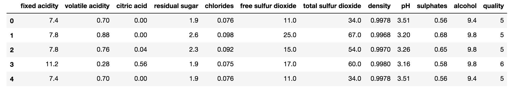

# ClassifyWineQuality
A simple Machine Learning project using SciKit Learn through the classification of wine quality

To begin, import the required packages, namely (1) Pandas, (2) Seaborn, (3) MatPlotLib, (4) Sklearn.

```python
import pandas as pd
import seaborn as sns
import matplotlib.pyplot as plt
from sklearn.ensemble import RandomForestClassifier
from sklearn.svm import SVC
from sklearn import svm
from sklearn.neural_network import MLPClassifier
from sklearn.metrics import confusion_matrix, classification_report
from sklearn.preprocessing import StandardScaler, LabelEncoder
from sklearn.model_selection import train_test_split
%matplotlib inline
```
`Pandas` is a very helpful library that aids in the manipulation and analysis of data. We will be working with a lot of data, hence Pandas is very important.

`Seaborn` is used for data visualization. Although not required for the purposes of our exemplar, it is still good to have it to gain some insights based on what we can see on the data through the visuals.

`MatPlotLib` is a 2D plotting library used in Python. `Seaborn`'s data visualization is based off of `MatPlotLib` - so we will import this as well. But again, is not necessary if Seaborn isn't used.

`Sklearn` (or SciKitLearn) is the machine learning library in Python, and it contains several various ML algorithms that we can use. For the purposes of this example, we will take a look into Random Forest Classifier, Support Vector, and Multi-Layer Perceptron. There are still a lot more of these algorithms; but if you are interested check out the link: https://scikit-learn.org/stable/

Let us begin by examining our data. For this, we will be using the `winequality-red.csv` dataset; you can download this dataset from Kaggle here: https://www.kaggle.com/uciml/red-wine-quality-cortez-et-al-2009

Now open your PyCharm, NotePad++, Sublime Text, or any other text-editor. Note that we will be working with Python for this example, so it is assumed that you have the basics of Python. But do not worry, if you are struggling with Python, you can just Google it up (especially the syntax), or read through here: https://www.w3schools.com/python/. Anyway, I am using the Jupyter Notebook in the Anaconda Navigator; it is very easy and convenient to use. I can easily run it and see the output right away because it compiles automatically. Below displays the two lines for loading our wine dataset into Python, store it into a dataframe called `wine` as well as displaying the first five rows of the dataframe.

```python
wine = pd.read_csv('winequality-red.csv', sep = ';')
wine.head()
```
This is the work of Pandas; it reads through our CSV file, with semi-colons as separators. It then stores it into a dataframe called `wine`. Here is what the first five rows of the dataframe looks like:



Also, typing in `wine.info()` gives some summarized information on what data are we dealing with:

```
<class 'pandas.core.frame.DataFrame'>
RangeIndex: 1599 entries, 0 to 1598
Data columns (total 12 columns):
fixed acidity           1599 non-null float64
volatile acidity        1599 non-null float64
citric acid             1599 non-null float64
residual sugar          1599 non-null float64
chlorides               1599 non-null float64
free sulfur dioxide     1599 non-null float64
total sulfur dioxide    1599 non-null float64
density                 1599 non-null float64
pH                      1599 non-null float64
sulphates               1599 non-null float64
alcohol                 1599 non-null float64
quality                 1599 non-null int64
dtypes: float64(11), int64(1)
memory usage: 150.0 KB
```

Normally, the dataset the you come across with contains some null values, or values that are blanks or missing. In that case, you have several options to handle such. One is to convert such values into 'legitimate' values. Another is to just take them out completely (i.e. remove the row containing `NULL` values completely). The latter option is highly recommended only if there are a few missing values. Otherwise, you might consider the former option as well. But for our exemplar, there is no need to deal with this as there are no null values. This is an ideal situation by the way, but not always. To verify this type in `wine.isnull.sum()`.

Now it is time for some data pre-processing. Try going over this code for now and I will explain in detail.

```python
bins = (2, 6.5, 8)       
group_names = ['bad', 'good']
wine['quality'] = pd.cut(wine['quality'], bins = bins, labels = group_names) 
wine['quality'].unique()
```

Ok, so first off we have to identify the dependent variable amongst our variables. It should have been done before, if you ask me. So since we are testing the quality of wine and that is the problem in hand, then therefore, the `quality` is our dependent variable (the `y`), while the rest of the other variables are the `x`'s (the independent variable). So now that we have identified our depenent variable, we can start looking at the code above and potentially the ones below. Let `bins` be a vector with the parameters `2`, `6.5`, and `8`. The number of bins is 2 (i.e. 2 bins of `quality`), the spread has a value of `6.5` and it has an index of `8`. The restriction for this triple is that it has to be monotonously increasing. `group_names` is just an array containing the label names for the wines, the bad wine and the good wine. For the purposes of this example, bad wines are those wines whose quality is less than 6.5; the good wines are those wines with quality of 6.5 and above. Notice that the minimum quality of wine is 2 and the maximum is 8. So bad wines are those wines whose quality is between 2 and 6.5 inclusive, and those wines between 6.5 and 8 are the good wines (viewing this in a spreadsheet or Excel file might convince you easily). The third line in the code above uses Pandas' cut function in order to cut or categorize the wines as good or bad depending on the quality. It makes use of the `bins` and `group_names`. `wine['quality'].unique()` simply outputs the unique values of `wine['quality']`

```python
[bad, good]
Categories (2, object): [bad < good]
```
